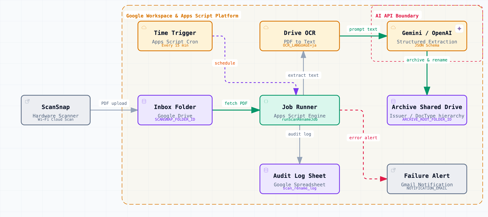

# ScanSnap automatic renaming

A Google Apps Script project that periodically scans ScanSnap PDFs in Google Drive and renames them to descriptive filenames using OCR and AI.

The initial setup keeps things small with `Google Apps Script + Drive + Spreadsheet log + external AI`. It is built so that the OCR / AI part alone can be split out to Cloud Run once heavy OCR or high-frequency processing becomes necessary.

[](https://hidenobunagai.github.io/scansnap_automatic_renaming/)

> 🌐 **Interactive Architecture Diagram**: [Open the interactive architecture diagram on GitHub Pages (theme switching, focus, detail view)](https://hidenobunagai.github.io/scansnap_automatic_renaming/)

## What this project does

- Periodically checks for new PDFs in the target folder
- Extracts text with Google Drive OCR
- Has Gemini or OpenAI generate naming candidates
- Formats to the `YYYY-MM-DD_発行元_書類種別_要点.pdf` pattern (`YYYY-MM-DD_issuer_document-type_summary.pdf`)
- Copies into a family-shared folder using the `発行元(半角英数字へ正規化)/書類種別` structure (issuer normalized to alphanumerics / document type)
- Avoids duplicate filenames by appending `_2`, `_3`
- Records results in a spreadsheet
- Supports two modes, `review` and `rename`

## Files

- `src/`: the main code pushed to Apps Script
- `scripts/write-clasp-config.mjs`: generates `.clasp.json` from the `dotenvx`-managed `CLASP_SCRIPT_ID`
- `scripts/bootstrap-remote-setup.mjs`: uses `clasp` to set properties, initialize, and create the trigger

## Setup

1. Create a new standalone project in Google Apps Script.
2. Note the script ID from the Apps Script `Project Settings`.
3. Initialize the local `.env` and save the script ID.

```bash
bun run env:init
dotenvx set CLASP_SCRIPT_ID your-script-id
dotenvx set CLASP_PROJECT_ID your-gcp-project-id
```

4. Generate `.clasp.json` and push.

```bash
bun run clasp:push
```

5. If you also want to use `clasp run`, link this script to a GCP project in the Apps Script `Project Settings`.
6. Create a `Desktop App` OAuth client on that GCP project and save `client_secret.json` locally.
7. Run `clasp login --creds client_secret.json --use-project-scopes`.
8. Set the required values in `Project Settings > Script properties` on the Apps Script side.
9. Run `setupScanRenameProject()` once to create the log spreadsheet automatically.
10. Start with `RENAME_MODE=review` and run `runScanRenameJob()` to check the proposed names.
11. Once everything looks fine, change to `RENAME_MODE=rename` and run `installScanRenameTrigger()`.

Alternatively, put the required environment variables in `.env` and configure everything from the CLI.

```bash
dotenvx set SCANSNAP_FOLDER_ID your-drive-folder-id
dotenvx set ARCHIVE_ROOT_FOLDER_URL https://drive.google.com/drive/folders/your-family-folder-id
dotenvx set GEMINI_API_KEY your-gemini-api-key
bun run setup:remote
```

This command does `clasp push`, API executable deployment, script property setup, log initialization, and trigger creation all at once.

As a prerequisite, you need the `GCP project` link for `clasp run` and to log in again with `client_secret.json`.

## Required script properties

| Key | Required | Example | Notes |
| --- | --- | --- | --- |
| `SCANSNAP_FOLDER_ID` | yes | `1AbCdEf...` | Drive folder ID to watch |
| `ARCHIVE_ROOT_FOLDER_ID` | required for rename | `1FamilyFolder...` | Drive folder ID of the shared archive destination |
| `AI_PROVIDER` | no | `gemini` | `gemini` or `openai`. Defaults to `gemini` |
| `GEMINI_API_KEY` | provider=gemini | `AIza...` | When using Gemini |
| `OPENAI_API_KEY` | provider=openai | `sk-...` | When using OpenAI |
| `OPENAI_BASE_URL` | provider=openai | `https://api.openai.com/v1/chat/completions` | OpenAI-compatible endpoint |
| `AI_MODEL` | no | `gemini-2.5-flash-lite` | Provider-specific default when unset (`gemini`→`gemini-2.5-flash-lite`, `openai`→`gpt-4o-mini`) |
| `RENAME_MODE` | no | `review` | `review` or `rename` |
| `MIN_CONFIDENCE` | no | `0.75` | Minimum confidence for auto-confirming during `rename` |
| `MAX_FILES_PER_RUN` | no | `5` | Maximum number of files processed per run |
| `FILE_STABLE_MINUTES` | no | `5` | Wait time to avoid files that were just modified |
| `OCR_LANGUAGE` | no | `ja` | Drive OCR language |
| `TRIGGER_MINUTES` | no | `15` | One of `1, 5, 10, 15, 30` |
| `TIMEZONE` | no | `Asia/Tokyo` | For date formatting |
| `FILENAME_PATTERN_HINT` | no | `YYYY-MM-DD_発行元_書類種別_要点` | Naming hint passed to the AI |
| `USER_WEAK_ISSUER_LABELS` | no | `お知らせ,アンケート` | If the AI's issuer candidate matches one of these, treat it as a weak issuer and correct it to a strong organization name from the body (comma-separated) |
| `LOG_SPREADSHEET_ID` | no | `1XyZ...` | Created automatically on first run if unset |
| `LOG_SHEET_NAME` | no | `scan_rename_log` | Log sheet name |
| `MAX_PROMPT_CHARS` | no | `12000` | Maximum number of OCR text characters passed to the AI |
| `MAX_SUBJECT_LENGTH` | no | `40` | Maximum length of the summary part of the filename |
| `MAX_ISSUER_LENGTH` | no | `30` | Maximum length of the issuer part of the filename / folder name |
| `MAX_DOCUMENT_TYPE_LENGTH` | no | `30` | Maximum length of the document type part of the filename / folder name |
| `NOTIFICATION_EMAIL` | no | `you@example.com` | Address to notify on `error`/`copy_failed` (no notification if unset) |

## Local commands

```bash
bun run env:init
bun run check
bun test
bun run format
bun run clasp:push
bun run clasp:open
bun run setup:remote
```

## Apps Script functions

- `setupScanRenameProject()`: prepares the log spreadsheet
- `runScanRenameJob()`: scans unprocessed PDFs and runs review / rename
- `installScanRenameTrigger()`: recreates the scheduled trigger
- `removeScanRenameTriggers()`: removes existing triggers
- `migrateArchiveFolderStructure()`: migrates existing archive folders from the old structure (document type / issuer) to the new structure (issuer normalized to alphanumerics / document type)
- `normalizeArchiveIssuerNames()`: normalizes existing issuer folder names, archived filenames, and issuer-related log fields to alphanumerics
- `correctArchiveIssuerFolders()`: corrects wrong issuer folders based on the body text or strong candidates in existing logs, and updates existing archive paths and filenames as well
- `getScriptPropertiesTemplate()`: returns a template of the configuration keys

## Operations

See [docs/runbook.md](docs/runbook.md) for details.

## Notes

- If almost no OCR text can be extracted, it stops with `review_needed`.
- Even if the AI's issuer candidate is a personal name or a generic label, it is corrected to that issuer when the OCR text, subject, or summary contains a strong organization name.
- In `review` mode you can still check the candidate path even when `ARCHIVE_ROOT_FOLDER_ID` is unset.
- Files checked in `review` are reprocessed once, on the first run after switching to `rename`.
- In `rename`, even if the filename is already finalized, the file is copied to the shared archive if it has not been copied yet.
- Files that fail to copy to the shared destination are recorded as `copy_failed` and retried on the next run.
- To reprocess a file, delete its row from the log sheet and run again.
- The Gemini API key is sent via the `x-goog-api-key` header rather than a URL query (to prevent leaks into logs or proxies).
- `executionApi.access` is set to `MYSELF` (owner only). `clasp run` (`setup:remote`) can run with owner authentication, so `ANYONE` is not needed. Deployments are created temporarily by `setup:remote`; when they are no longer needed, check with `clasp deployments` and delete with `clasp undeploy <deploymentId>`. If you change it to `ANYONE`, any account that knows the deployment ID can run it, so avoid making it public or shared.
- If large or image-heavy PDFs increase, splitting only the OCR / AI calls out to Cloud Run is the next step.
